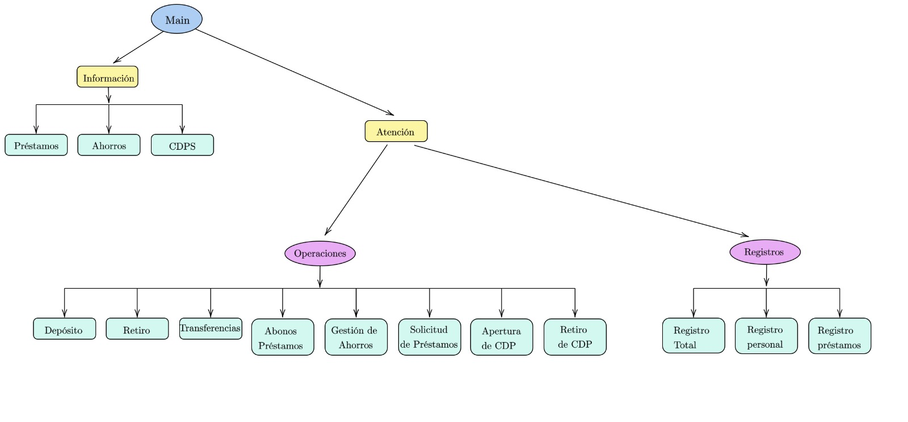
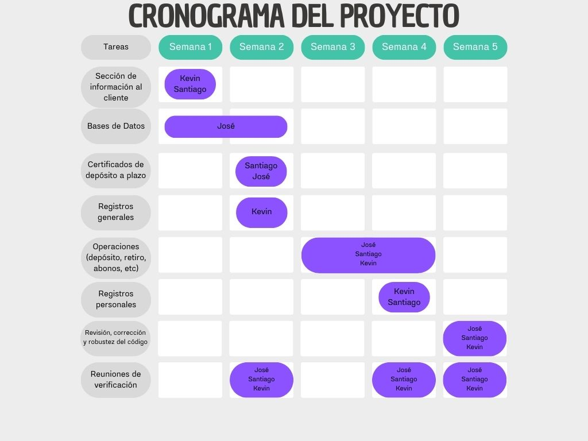

# Proyecto Final
## Curso: Estructuras abstractas de datos y algoritmos para ingenieria 0217.
## Prof. Esteban Badilla
### Integrantes:
* Santiago Herra Castro C1721
* José Ignacio Sáenz Díaz C27032
* Kevin Jiménez Acuña C13876

## Descripción de proyecto.
Este proyecto se centra en la investigación, diseño e implementación de un sistema de gestión bancaria. Esta siendo para poder ser utilizado por agentes en ventanillas bancaria, facilitando tanto la atención a clientes como la gestion de información de prestamos bancarios.

### Funcionalidad:

* El sistema inicia preguntando si se va a utilizar para la atención al cliente o para gestionar información de préstamos, asi teniendo una interacción específica según el objetivo del usuario.
* Si la persona desea gestionar información sobre préstamos se generara una tabla de pagos personalizados en base al monto que el usuario ingrese, con esto se generará la tabla con la cantidad de cuotas, tasas de interés y los diferentes plazo a la disposición del banco.
* Los clientes pueden gestionar hasta 2 cuentas bancarias. una en colones y otra en dólares, además de obtener certificados de depósito a plazo.
* El sistema cuenta con diversas operaciones disponibles, como lo son depósitos, retiros, transferencias entre cuentas dirigidas a otros clientes, entre otras.
* El sistema cuenta con un registro de tipo historial de todas las transacciones realizadas en el sistema. Este registro muestra el número identificador del cliente, el tipo de transacción que realizó, el monto implicado en dicha transacción y el número identificador de un segundo cliente en caso de que el tipo de transacción involucre a un segundo.
* Se identifica a los clientes en el sistema, con un número único de identificación, el cual estará limitado a un número entero entre 0 y 999999999.
* Los clientes pueden contar con préstamos asociados en colones o en dólares. Cada uno de estos con características específicas como la tasa de interés, el período en meses y la cuota mensual.
* Los clientes pueden solicitar un reporte de sus préstamos, a lo que el sistema responderá generando un archivo de texto que detalle cada una de las cuotas pagadas, desglose el aporte de capital y los intereses abonados hasta el momento.

## Prestamos:
Los prestamos se realizarán en base al monto que la persona desee obtener, el salario que la persona posea y moneda que la persona desee. En cuanto se tenga esto se desplegará una tabla con las opciones posibles donde la persona podrá elegir la cuota mensual que deberá pagar en base al lapso de tiempo por el que escoja el préstamos, esto dependiendo del salario que esta persona tenga. Las tasas de interés las dara el banco las cuales varían dependiendo del tipo de préstamo que la persona escoja. Además, se debe de considerar que los préstamos pueden ser en colones o en dólares.

La fórmula para calcular la cuota mensual es [1]:

$$ 
\text{Cuota mensual} = \text{Monto total} \cdot \frac{TEM \cdot (1+TEM)^n}{(1+TEM)^n-1}
$$

Donde, 

-TEM se refiere a la tasa efectiva mensual

-n se refiere a la cantidad de meses de pago

-Monto se refiere al monto total del préstamo hipotecario

Los intereses dados por el banco en las tablas personalizadas son anuales, entonces se necesita convertir los intereses anuales a mensuales. La formula de intereses mensuales es:

$$
TEM = (1 + r)^{1/12} - 1
$$

Donde:
- r: Es el interes anual

### Pestamos personales:
Los prestamos personales es un tipo de credito **no asegurado** que ofrecen los bacos y otras instituciones financieras a los individuos. Este tipo de prestamo no requiere que la persona ofrazca un objeto colateral para asegurar el prestamo. La tasa de interes que dara el banco para un prestamos personal usualmente es de 18% hasta 26%, segun los dato tomados de la pagina del BAC [2]. 

El banco le da al cliente los siguientes requerimientos como:
* Constancia salarial.
* Colilla de pago del ultimo mes
* Orden patronal.

La colilla de pago del ultimo mes es esencial gracias a que es necesaria para analizar la capacidad de pago del cliente de las cuotas mensuales del prestamo. No se aceptaran clientes los cuales tenga un salario bruto menor a 450.000 o su equivalente en dolares y las cuotas mensuales no pueden ser mayores al 55% del salario bruto [3].

 Tomando en cuenta estos valores, al cliente se le ofreceria una tabla personalizada para sus prestamos:  

Segun el monto de 5000000₡, con una tasa de cambio de 512.33₡ el dolar.

| Intereses anuales | 24 meses | 60 meses | 84 meses | Tipo de Moneda |
|-------------------|----------|----------|----------|----------------|
|        20%        | 240,519₡ | 127,979₡ | 106,180₡ |    Colones     |
|        16%        |  473,20$ |  231.9$  | 188.08$  |    Dolares     |


## Préstamos prendarios:
Los préstamos prendarios son aquellos en los que la entidad bancaria solicita al cliente que requiere el préstamo, entregarle uno o varios activos físicos o financieros como garantía de que cumplirá con lo acordado según el préstamo [2]. Una forma más sencilla de comprender este tipo de préstamo es visualizarlo como si fuera lo que popularmente se conoce como "empeño", en donde un individuo cede un activo físico de forma temporal a una casa de empeño a cambio de dinero; en el caso del préstamo prendario sucede de forma similar, cediendo bienes como vehículos y acciones que permitirán eventualmente a la entidad bancaria, embargar o vender en caso de que el cliente incumpla con sus acuerdos y de esta forma, recuperar la inversión [4].

En cuanto a las características generales de este tipo de préstamos, se encuentra una baja considerable en los intereses a comparación de los préstamos personales (estos son más comunes en las entidades bancarias), encontrándose estas entre el 1% y 5% y además, generalmente este tipo de préstamos cuenta con plazos de rembolso menores, siendo estos de entre 1 y 8 años (dependiendo de la cantidad de dinero solicitada por el cliente) [4]. Es necesario destacar que la cantidad de dinero recibida por el cliente puede depender del valor de los bienes que haya entregado, y estos no serán devueltos hasta que se finalice la devolución del dinero prestado [4].

Por último, el cliente que presenta el préstamo prendario no se ve afectado por comisiones por amortización o cancelación anticipada; esto quiere decir que el cliente que entregó uno o más bienes puede recuperarlo sin tener que realizar ningún tipo de gasto extra como consecuencia [4]. 

En este sistema, para solicitar un crédito prendario, es necesario tomar en cuenta que:

* Se financia el 80% del valor del avualuo del colateral ofrecido como garantía.
* Financiación mínima es de cinco millones de colones.
* El cliente solcitante requiere 6 meses de continuidad laboral.

A continuación, se muestran la tabla de valores con las opciones que puede seleccionar el cliente:

| Tasa de interés anual | 6 años  | 7 años  | 8 años  | Tipo de Moneda |
|-----------------------|---------|---------|---------|----------------|
| 12%                   |97 750,9₡|88 263,6₡|81 264,2₡| Colones        |
| 7,25%                 |167,64$  |148,56$  |134,33$  | Dólares        |

**Nota, esto sería para el caso en que se soliciten cinco millones de colones o su equivalente en dólares con una tasa de cambio de 512,33 colones (tasa de cambio del 26 de mayo de 2024). Datos tomados de la página oficial de BAC Credomatic [5].**

### Préstamos Hipotecarios:
Un préstamo hipotecario hace referencia a un préstamo que se da con el fin de que se realice una compra de vivienda o de terreno. Debido al monto alto que conlleva este flujo de dinero, el préstamo hipotecario tiene la particularidad de que la garantía de pago es el bien inmueble, es decir, la vivienda o el terreno que se está adquiriendo. Como los demás tipos de préstamo, este se encuentra definidio por una tasa de interés, de la que depende la cantidad adicional de dinero que se debe de pagar por el monto prestado. No obstante, debido a tratarse de montos grandes, los plazos ofrecidos por los bancos son de 36 hasta 360 meses [6]. Por ello, es usual que la tasa de interés varíe. Por ello, las tasas de interés suelen ser variables. Tomando como referencia las condiciones brindadas por el Banco de Costa Rica, se muestra la siguiente tasa variable [7]:

-Durante los primeros dos años enteros del préstamo, la tasa es fija de un 12%.

-Durante el resto del plazo, la tasa se calculará según la siguiente ecuación, con piso 12%:

$$ 
tasa = TBP + 6,50% 
$$

Esto implica, que la tasa variable se calcula según la Tasa Básica Pasiva o TBP, brindada por el Banco Central que varía según las condiciones del mercado. A esta tasa, se le debe de sumar el 6,5%, lo que se conoce como el margen. No obstante por la seguridad del prestamista, se establece un piso, que es que no importa que tanto caiga la TBP, el valor menor que puede tener la tasa es del 12%. Para el proyecto, tomando en cuenta los datos de Costa Rica, brindados por el Banco Central, el valor de la TBP ponderado desde el 2013 es de 5,47% [8]. Por ello, si se toma la fórmula y se calcula la tasa con este valor, se obtiene una tasa menor a la tasa piso. Además, para el año 2024, la tasa se encuentra en una tendencia decreciente, donde el promedio anual es del 5,00%. Por ello, se considerará para el proyecto una tasa fija del 12%, puesto que en promedio, la tasa calculada no supera el piso. 

Se limitarán los plazos al igual que lo realiza el BCR, donde los plazos disponibles se encuentran en múltiplos de 5 años, donde el mínimo son 5 años y el máximo 30. El cliente deberá de ingresar el valor total de la casa y el valor a solicitar, puesto que ningún banco nacional suele financiar más del 80% de la propiedad. Aparte, se tendrá un valor mínimo de 5 millones de colones y un valor máximo de 150 millones de colones.

### Cuentas bancarias y gestión de ahorro:

La personas pueden tener cuentas bancarias las cuales pueden ser en dólares o colones, dichas pueden poseer un máximo de dos cuentas bancarias. Estas están destinadas a la gestión de sus ahorros, donde que se utilizarán para obtener certificados de depósito a plazo. 

Las cuentas de ahorros pueden ser utilizadas para el pago de prestamos desde la cuenta que el cliente desee, para que esto sea posible se debe de tener tener la tasa de cambio de colones a dolores, para acciones de venta y compra, dichos valores estan dados por el Banco Central de Costa Rica. 

## Certificados de Depósito a plazos:

Los certificados de depositos a plazo (CDP) son certificados que da el banco cuando una persona desee ingresar un capital para poder obtener intereses en un plazo de tiempo determinado. Dicho certificado valida dicho ingreso del capital e indica la tasa de interes que obtendra el cliente por el tiempo en que mantendra el capital dentro del banco[9]. Las ventajas de tener un CDP es tener una inversion respaldada por el banco y posee tasa de interes mas altas. Los interes varian dependiendo de la cantidad del monto que se desee ahorrar, el plazo por el que el cliente ahorre y la moneda del monto, los bancos dan mayores tasas de intereses a ahorros en dolares[10]. La mayoria de bancos utilizan interes simples segun tasa de interes que se le de al cliente. El BCR, acepta valores minimos de 50000₡ y 100$.
 

 Los interes que se le daran al cliente esta dada por [11]:

$$
I = P * r * t
$$

Donde:
- I: Son los interes ganados durante un plazo de tiempo.
- P: Es el principal monto ahorrado.
- r: Es la tasa de interes dada por el banco.
- t: Es el tiempo por el cual se acordo guardar el ahorro. 

## Registros contables

Un registro contable descrito en su forma más esencial, es el soporte físico o digital, donde se almacena toda la información financiera de las compañías durante un período de tiempo, este le permite a las compañías obtener un balance general y un estado financiero [12].

Existen registros contables obligatorios y no obligatorios. Entre los obligatorios se encuentra el Libro Diario, en este se registran diariamente todas las operaciones que la empresa realiza a nivel financiero y consisten en asientos contables que se construyen cronológicamente, también se encuentran los libros de inventarios y balances; estos dan detalles de la actividad empresarial y patrimonio desde el origen de la empresa [12].

Los registros no obligatorios, son registros no exigidos por la ley pero que la empresa elabora para organizar su estructura financiera y tributaria, entre estos se encuentran: el estado de flujos de efectivo (entrada y salida de dinero en efectivo), estado de resultados (totalidad de ingresos y egresos del negocio) y el balance (registra todos los activos y los pasivos de la empresa) [12].

En el caso del estado de resultados, encuentra su importancia en que a partir de este la empresa puede desarrollar un análisis de que tan rentable es su empresa y además, da un seguimiento de todos aquellos clientes que aún no han realizado sus pagos y de todos aquellos gastos que se encuentran sin amortizar [12].

A continuación, se muestran todos aquellos datos que deben estar presentes en un registro de transacciones para que este pueda evidenciar la información necesaria tanto para la entidad financiera, como para los clientes [12]:

+ Fecha y hora en la que se realiza la transacción.
+ Número de transacción.
+ Cuentas que intervienen en el proceso, representadas por su código y denominación.
+ Importes registrados a cada una de las cuentas involucradas en la transacción.
+ Descripción detallada de la transacción.

En cuanto a los beneficios más importantes de utilizar registros contables, se encuentran: el monitorear regularmente el crecimiento general del negocio, la facilitación en la elaboración de estrategias políticas y comerciales orientadas al mercado y el aumento de la rapidez y la eficacia para la toma de decisiones de la empresa [13]. Este monitoreo regular del negocio, permite a los accionistas conocer la rentabilidad y la proyección financiera de la entidad y en función de estos, tomar las decisiones que consideren adecuadas para el futuro de dicha entidad, mientras que la elaboración de estrategias políticas y comerciales permite dirigir a una empresa hacia su crecimiento financiero a partir del aumento de sus ingresos generado por una mayor atracción de clientes. Por último, la rapidez y eficacia al tomar decisiones permitirá eventualmente realizar mejores negociaciones con otras compañías y marcas asociadas, lo que implica al igual que en el beneficio anterior, el crecimiento financiero de la empresa.


## Base de datos:

Para el correcto funcionamiento del programa, es necesario establecer una base de datos robusta y eficiente, que tenga la cantidad justa de tablas relacionadas, para que la posterior inserción, modificación y deleción de información sea de forma sencilla e intuitiva. Por ello, es importante plantear desde etapas tempranas la estructura de dicha base de datos, con el fin de optimizar los algoritmos a implementar. Por ello, se definirán las tablas pertenecientes a la base de datos del sistema bancario, no sin antes resaltar una serie de características claves del sistema a trabajar:
-Cada cliente puede tener únicamente una cuenta en colones y una cuenta en dólares, por ello, se prefiere que la llave foránea a la cuenta se encuentre en la tabla de clientes. Esto con el fin de que se puede asociar una cuenta a múltiples clientes.
- Un cliente puede tener múltiples préstamos y CDPs, por lo que los CDPs contendrán el número de cédula del usuario como llave foránea al cliente que pertenecen.
- Un préstamo puede ser caracterizado únicamente por su tasa, su monto total, su plazo en meses y su cantidad de cuotas mensuales pagadas. Si se almacenacen variables como el el total abonado, se estaría siendo redundante.
- Los CDPs se pueden caracterizar por el monto del depósito, el plazo y la tasa de intereses.
- El número de cédula se usará como llave primaria, puesto que es única para cada persona. 

### Tabla Clientes:
La tabla clientes contendrá la información de cada cliente por separado. Esta almacenará el número de cédula que será la llave primaria y el nombre completo del cliente.

| **Columna**       | **Tipo de Dato** | **Descripción**                              |
|-------------------|------------------|----------------------------------------------|
| cedula            | INT              | Número de cédula (llave primaria)            |
| nombre            | VARCHAR(50)      | Nombre del cliente                           |
| apellido          | VARCHAR(50)      | Apellido del cliente                         |
| cuenta_colones    | INT              | Cuenta en colones (llave foránea)            |
| cuenta_dolares    | INT              | Cuenta en dólares (llave foránea)            |

```sql
CREATE TABLE clientes (
    cedula CHAR(9) PRIMARY KEY,
    nombre VARCHAR(50),
    apellido VARCHAR(50),
    cuenta_colones INT,
    cuenta_dolares INT,
    cdp INT,
    CHECK (cedula NOT LIKE '%[^0-9]%'),
    FOREIGN KEY (cuenta_colones) REFERENCES cuentas(numero_cuenta)
    FOREIGN KEY (cuenta_dolares) REFERENCES cuentas(numero_cuenta)
);
```

Los enteros de cuenta_colones, cuenta_dolares y cdp hacen referencia al número de cuenta o número de certificado, que es un número único. 

### Tabla Cuentas:
Las cuentas incluirán el número de cuenta que será la llave primaria, el balance de la cuenta, que será un DECIMAL(9,2) para almacenar un máximo de centésimas de colón o de dolar. Por otra parte, tendrá un Tasa decimal(2,2) que contendrá la tasa de interés de ahorro de la cuenta. Se tendrá un varchar que represente la denominación que maneja la cuenta. Por último, se tendrá una llave foránea que apunte al clienteLa tabla se observa a continuación:

| **Columna**   | **Tipo de Dato** | **Descripción**                            |
|---------------|------------------|--------------------------------------------|
| numero_cuenta | INT              | Número de cuenta (llave primaria)          |
| balance       | DECIMAL(9, 2)    | Balance de la cuenta                       |
| tasa          | DECIMAL(2, 2)    | Tasa de interés de ahorro de la cuenta     |
| denominacion  | VARCHAR(10)      | Denominación de la moneda (colones/dólares)|

```sql
CREATE TABLE cuentas (
    numero_cuenta INT PRIMARY KEY,
    balance DECIMAL(9, 2),
    tasa DECIMAL(2, 2),
    denominacion VARCHAR(10)
);
```

### Tabla Préstamos:
Ahora, se presenta la descripción de la tabla de préstamos. De nuevo, cada préstamo tendrá una id única, siendo un número entero que corresponde al número de préstamo. Existirá una fila que contenga un varchar que hace referencia a la denominación, ya sea colones o dólares. Contendrá un DECIMAL(9,2) que hace referencia al monto total del préstamo. Además, existirá una fila que contengan un INT, que referencien el plazo en meses y un DECIMAL(2,2) que haga referencia a la tasa del descuento. Aparte, es necesario un VARCHAR que referPor último, contendrá un INT que será la llave foránea que referenciará al usuario que solicitó el préstamo, esto puesto que un cliente puede tener varios préstamos asociados. 

| **Columna**          | **Tipo de Dato** | **Descripción**                                                  |
|----------------------|------------------|------------------------------------------------------------------|
| prestamo_id          | INT              | Número único que identifica el préstamo (llave primaria)         |
| tipo                 | VARCHAR(11)      | Tipo de préstamo, ya sea prendario, hipotecario o personal       |
| denominacion         | VARCHAR(8)       | Denominación de la moneda del préstamo (colones/dólares)         |
| monto_total          | DECIMAL(9, 2)    | Monto total del préstamo                                         |
| plazo_meses          | INT              | Plazo del préstamo en meses                                      |
| tasa                 | DECIMAL(2, 2)    | Tasa de interés de ahorro de la cuenta                           |
| cliente_id           | INT              | Llave foránea que referencia al cliente que solicitó el préstamo |

```sql
CREATE TABLE prestamos (
    prestamo_id INT PRIMARY KEY,
    denominacion VARCHAR(8),
    tipo VARCHAR(10),
    monto_total DECIMAL(9, 2),
    plazo_meses INT,
    cuota_mensual INT,
    cliente_id INT,
    FOREIGN KEY (cliente) REFERENCES clientes(cedula)
);
```
### Tabla CDP:
Por último, se presenta la descripción de la tabla de certificados de depósito a plazos. Esta tabla contendrá un identificador único siendo la llave primaria de tipo INT. Se necesitará de un VARCHAR que haga referencia a la denominación, ya sea colones o dólares. Posteriormente, se tendrá un decimal(2,2) que haga referencia a la tasa. Además, se tendrá un int que haga referencia al plazo en meses. Por último, es necesario un DECIMAL(9,2) que se refiera al monto del depósito original. Ahora, como cada cliente puede tener varios CDPs de forma simultánea, se necesitará una llave foránea que referencia al número de cédula del cliente que lo solicitó. 

| **Columna**       | **Tipo de Dato** | **Descripción**                                             |
|-------------------|------------------|-------------------------------------------------------------|
| cdp_id            | INT              | Identificador único del CDP (llave primaria)                |
| denominacion      | VARCHAR(8)       | Denominación de la moneda del CDP (colones/dólares)         |
| tasa              | DECIMAL(2, 2)    | Tasa de interés del CDP                                     |
| plazo_meses       | INT              | Plazo en meses del CDP                                      |
| monto_deposito    | DECIMAL(9, 2)    | Monto del depósito original del CDP                         |
| cliente_cedula    | CHAR(9)          | Llave foránea que referencia al cliente que solicitó el CDP |

```sql
CREATE TABLE certificados_de_deposito (
    cdp_id INT PRIMARY KEY,
    denominacion VARCHAR(8),
    tasa DECIMAL(2, 2),
    plazo_meses INT,
    monto_deposito DECIMAL(9, 2),
    cliente_cedula CHAR(9),
    FOREIGN KEY (cliente) REFERENCES clientes(cedula)
);
```

### Tabla de registros:
Se presenta a continuación la descripción de una tabla para la base de datos, la tabla de registros. Cada registro tendrá un ID único que es un INT, la llave primaria. Este registro almacenará una VARCHAR que hace referencia al tipo de transacción, pudiendo representar, depósitos, retiros, registros, abono a préstamos, solicitud de préstamo, transferencia, apertura de CDP o retiro de CDP. También tendrá un DATE que almacene la fecha de la transacción. Tendrá un VARCHAR que haga referencia a la denominación, ya sea colones o dólares. Además, tendrá un INT cliente que represente el número de cédula del cliente que realiza la transacción y tendrá otro INT cliente que represente el número de cédula del cliente que recibe la transacción (puede ser el mismo cliente).  Contendrá un DECIMAL(9,2) que represente el monto base de la transacción, en caso de ser un depósito, retiro, abono o transferencia simplemente se refiere a la cantidad de dinero que participa del trámite. En caso de apertura de CDP o solicitud de préstamo, se refiere al depósito inicial o al monto total del préstamo. Nótese que existen algunas restricciones que se impondrán más adelante, como que en caso de préstamo, un usuario no puede solicitarle un préstamo a otro.

| **Columna**                | **Tipo de Datos**    | **Descripción**                                                                 |
|----------------------------|----------------------|---------------------------------------------------------------------------------|
| **ID**                     | INT                  | Identificador único del registro (Llave primaria)                               |
| **tipo_transaccion**       | VARCHAR(50)          | Tipo de transacción (depósitos, retiros, registros, abono a préstamos, etc.)    |
| **fecha_transaccion**      | DATE                 | Fecha de la transacción                                                         |
| **denominacion**           | VARCHAR(10)          | Moneda de la transacción (colones o dólares)                                    |
| **cliente_origen_cedula**  | INT                  | Número de cédula del cliente que realiza la transacción (Llave foránea)         |
| **cliente_destino_cedula** | INT                  | Número de cédula del cliente que recibe la transacción (Llave foránea)          |
| **monto_base**             | DECIMAL(9,2)         | Monto de la transacción                                                         |

```sql
CREATE TABLE registros (
    ID INT PRIMARY KEY,
    tipo_transaccion VARCHAR(50),
    fecha_transaccion DATE,
    denominacion VARCHAR(10),
    cliente_origen_cedula INT,
    cliente_destino_cedula INT,
    monto_base DECIMAL(9,2),
    FOREIGN KEY (cliente_origen_cedula) REFERENCES clientes(cedula),
    FOREIGN KEY (cliente_destino_cedula) REFERENCES clientes(cedula)
);
```

## Funcionamiento del programa:
Se diseño una estructura del programa para poder capturar la esencia y funcionamiento del programa para que sea facil de usar para el encargado, implementando los diferentes propositos y la informacion necesaria para el encargado y el cliente. 



## Cronograma:
Se dividio el trabajo entre los integrante del grupo para medir los avances semanales del proyecto y poder implementar una estrategia de equipo hacia la resolucion de los problemas en el desarrollo del codigo. Se planteo trabajar simulteaneamente para poder ayudarse unos a otros durante el proceso. Ademas se organizaran reuniones de equipo cada 2 semanas para poder ver el progreso del codigo, replantear soluciones y reestructurar el flujo de trabajo por si surgen problemas imprevistos.




## Referencias

[1] "¿Cómo calcular la cuota para un préstamo?", BBVA, 2024. https://www.bbva.pe/blog/mis-finanzas/financiamiento/-como-calcular-la-cuota-para-un-prestamo-.html (accedido 26 de mayo de 2024).

[2] "Prestamo personal". BAC. Accedido el 23 de Mayo de 2024. [En linea]. https://www.baccredomatic.com/es-cr/personas/prestamos?categoria=personales&nombre=prestamo-personal&id=165901

[3] "Creditos Personales para cada necesidad". COOPENAE. Accedido el 26 de Mayo de 2024. [En linea]. https://www.coopenae.fi.cr/credito-personal

[4] “¿Qué es un préstamo prendario?: Características y ejemplos”. Santander Consumer Finance. Accedido el 24 de mayo de 2024. [En línea]. Disponible: https://www.santanderconsumer.es/blog/post/que-es-un-prestamo-prendario-caracteristicas-y-ejemplos

[5] “Préstamos Destacados”. BAC Credomátic. Accedido el 25 de mayo de 2024. [En línea]. Disponible: https://www.baccredomatic.com/es-cr/personas/prestamos?categoria=destacados&amp;bacid=CRIN-CORE-CPR-000007-GL-AW-PR-GG-B6-SR-00000/SEARCH-VEL-PPRENDARIO-NOBRAND-BROAD&amp;gclid=Cj0KCQjwu8uyBhC6ARIsAKwBGpRBq1byGhW05q1Fy7_K4r_2Sssz97o6e93dUTfRk0nDlo6utAl7pt8aAlw-EALw_wcB&amp;nombre=compra-de-casa&amp;id=165906

[6] "¿Cómo funciona una hipoteca?", Banco Sabadell, 2024. https://www.bancsabadell.com/bsnacional/es/blog/como-funciona-una-hipoteca/#:~:text=Una%20hipoteca%20es%20un%20pr%C3%A9stamo,pago%20es%20el%20propio%20inmueble. (accedido 26 de mayo de 2024).

[7] "Solicitud de Préstamo Hipotecario", BAC Costa Rica, 2024. https://www.baccredomatic.com/es-cr/personas/prestamos/vivienda/terminada/solicitud (accedido 24 de mayo de 2024).

[8] "Tasa Básica Pasiva (TBP):, Banco Central de Costa Rica, 2024. https://gee.bccr.fi.cr/indicadoreseconomicos/cuadros/frmvercatcuadro.aspx?idioma=1&codcuadro=%2017 (accedido 26 de mayo de 2024).

[9] "Que es el Certificado de Deposito de Ahorro o CDA". Rossana Cardozo. Accedido el 23 de Mayo de 2024. [En linea]. https://www.bbva.com/es/innovacion/doce-consejos-de-seguridad-para-usar-la-banca-digital/

[10] "Tasas de intereses para CDP's". Banco de Costa Rica (BCR). Accedido el 26 de Mayo de 2024. [En linea]. https://www.bancobcr.com/wps/portal/bcr/bancobcr/personas/inversiones/certificados_de_deposito_a_plazo tasas_de_interes_para_cdps/

[11] "Interes simple y compuesto, como calcularlo e implementarlo". GBS Group Staff. Accedido el 26 de Mayo de 2024. [En linea]. https://blog.gbsgroup.net/blog/interes-simple-y-compuesto-como-calcularlo-e-implementarlo 

[12] “Registros contables, qué són, cómo llevarlos y todo lo que debes saber”. Contífico. Accedido el 26 de mayo de 2024. [En línea]. Disponible: https://contifico.com/que-son-los-registros-contables/

[13] “Importancia de los registros contables en una empresa”. JLC Auditors. Accedido el 26 de mayo de 2024. [En línea]. Disponible: https://jlcauditors.com/importancia-registros-contables-empresa/

